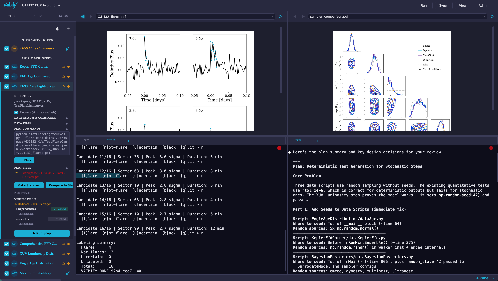

  

<h1 align="center">Vibe Boldly. Verify Everything.</h1>

  
  
  
  
   
  
  
  
   
  
  
  

`vaibify` creates secure, containerized environments for AI-assisted data analysis that can be accessed through a web application. It fully embraces agentic AI code development, but recognizes that a human must verify all results. `vaibify` builds secure environments (Docker containers) that prevent AI agents from harming your sensitive data. These containers can be monitored and modified through an applicaition that includs terminal window(s) for running agents like `Claude Code` and "viewing windows" for inspecting results (data files, figures, animations). Work with agents to be creative in a sandbox, develop a toolkit, or enter "workflow" mode, which enables pipeline development with automated and manual verification tracking for each step. `vaibify` is vigilent, alerting you to changes in your dependencies, so when your agent edits a critical file that updates an output file in Step 3, you immediately know all the downstream consequences. Seamlessly link your work with external resources like GitHub, Overleaf, and Zenodo for monitoring software development, writing reports, and archiving your results. `vaibify` allows you to vibe code with confidence: your host machine stays safe while the agents freely develop code and build your analysis pipeline — all with minimal IDE interaction — enabling you to focus on vetting the results via visual inspection, writing up a summary, and acting on the new insight.

In this screenshot of the `vaibify` dashboard, the steps to your workflow are tracked on the left. View the contents of the `vaibify` container along the top row in "viewing windows". Manage your agents and navigate the container yourself in terminal window(s) in the bottom of the GUI. Use buttons and menus to perform most basic tasks, or ask your agent to make changes. Additional pages allow you to create and manage containers and workflows (see documentation).

Note that `vaibify` can take over an hour to install -- the container requires the installation of a specific operating system. See the [full documentation](https://RoryBarnes.github.io/vaibify) for installation instructions, CLI reference, configuration, security model, and contributor guidelines. But you can get started with just a few commands, depending on your system. Read the [Quick Start Guide](https://RoryBarnes.github.io/vaibify/QuickStart.html), then just run `vaibify` to launch the GUI that will guide you through building containers, creating workflows, synching with external services, and verifying you vibe-coded scientific workflows.

If you use `vaibify` in your research, please consider citing "Barnes, R. et al. (2026), ApJ, submitted."

© 2026 Rory Barnes.
