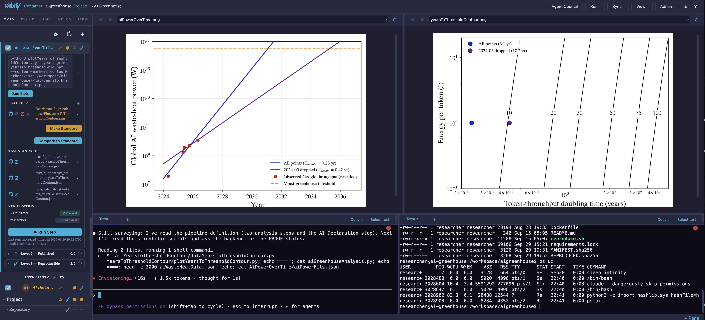

# Environments and Projects

Vaibify organizes work around two ideas. An **environment** is where
the work runs: a Docker container, or a folder on your own computer.
A **Project** is what the work is: a scientific analysis decomposed
into **Steps** that vaibify runs, watches, tests, and grades on
[the PROOF Ladder](proofLadder.md). One environment can hold several
Projects. You manage both through the dashboard in your browser.



## Environments

### What an environment is

A **container environment** is a Docker container built from a
`vaibify.yml` recipe. Its files live in a workspace volume
(`/workspace`) that is separate from your computer's disk, its user is
unprivileged, and nothing it runs can read or change files on your
computer. That containment is what makes it safe to let a coding agent
work for hours without approving each command, and a pinned,
rebuildable image is what lets a result reach PROOF Level 3.

A **host environment** ("This machine") is a folder on your own
computer. Nothing is built, so you can start immediately, but every
command runs with your full user authority: your files, your network,
your stored credentials. Vaibify says so before you open one, marks
every screen with a **HOST MODE — uncontained** badge, and opens each
terminal with a reminder that the shell runs on your machine. A host
environment cannot reach PROOF Level 3 or provide Supervised
attribution. It suits first contact and experimentation; containerize
it when the work becomes real.

### The environments page

Running `vaibify` with no subcommand opens the environments page in
your browser. It lists every environment registered on this computer
under **This machine**, with four buttons beside the heading:

| Button | Action |
|---|---|
| **+** | Add an environment. |
| **↻** | Refresh the list. |
| **⧉** | Open a new vaibify window (a separate browser session). |
| **?** | Help: creating an environment, a legend of tile marks, and troubleshooting. |

Each tile shows a status light, the name, and a chip reading
**contained** or **uncontained**. Clicking a tile opens the
environment, building or starting the container first if needed. From
inside the dashboard, **Admin > Environments** returns here.

When something fails on this page, the error message ends with *Click
to run a diagnosis*. The click runs vaibify's checks of this computer
and shows each finding with its remedy.

### Adding an environment

**+** opens **Add Environment**, which first asks where the work runs:

- **Container** — contained and reproducible; needs Docker.
- **This machine** — no container; for experimentation.
- **Reproduce a published project** — re-run somebody else's published
  result in a throwaway container. See [Reproducibility](reproducibility.md).

It then asks how the environment arrives:

- **Add Existing** — choose a directory that already holds a
  `vaibify.yml` (one a collaborator shared, or one you cloned). The
  existing file is read, never overwritten.
- **Create New** — the creation wizard writes a new `vaibify.yml`.

### The container wizard

**Create New** walks through these pages. A host environment needs
only the directory, the template, and the summary.

| Page | What it sets |
|---|---|
| **Project Directory** | The folder on your computer that holds `vaibify.yml`. |
| **Template** | The starter files: `sandbox`, `toolkit`, or `workflow` (see [Templates](#templates)). |
| **Project Name** | The project name and the Docker container name. |
| **Python Version** | 3.9 to 3.14; 3.12 by default. |
| **Repositories** | Git URLs cloned into the workspace at first start (required for `toolkit`). |
| **Features & Authentication** | Coding-agent command-line tools, JupyterLab, LaTeX, R, Julia, a PostgreSQL client, DVC, and NVIDIA GPU support; GitHub authentication; runtime options (sleep prevention on macOS, network isolation, X11 display forwarding); and resource limits. |
| **Packages** | System packages (apt) and Python packages, with an **Advanced** section for the package manager, pip flags, container user, base image, and workspace root. |
| **Summary** | Review, then **Create**. |

**Create** writes `vaibify.yml` and registers the environment; the
image is built the first time you open its tile. A minimal image
builds in minutes, and large feature sets can take an hour or more.
Anything missed can be added later: install it from a terminal inside
the container (lost on rebuild), or add it to `vaibify.yml` and
rebuild (permanent). The full list of `vaibify.yml` keys is in
[Advanced Installation](install.md).

### Templates

A template is the small set of starter files copied into a new
environment. Three ship with vaibify, one for each way of working:

| Template | Contains | Use it when |
|---|---|---|
| `sandbox` | No Project file | You want to explore freely: write code, make plots, try ideas. There are no steps or tests, so a sandbox sits below Level 1 of [the PROOF Ladder](proofLadder.md); its only property is containment. |
| `toolkit` | A Project file with no steps, and a `README.md` | You are developing several code repositories that must work together. Each repository listed on the wizard's **Repositories** page is cloned and appears in the **Repos** panel with its branch, uncommitted changes, and push controls. |
| `workflow` | A runnable two-step Project | You already know the analysis is a sequence of steps. The first step draws random samples; the second plots their histogram, receiving the samples through a `{step:generate-samples.samples}` token, so a new environment makes a figure on its first **Run**. Replace both steps with your own. |

If you are unsure, start with `sandbox`. The choice is not permanent:
exploratory work can become a Project later (see [Turning exploration
into a Project](#turning-exploration-into-a-project)).

### Containerizing a host environment

A host environment's tile menu (**⋮**) offers **Containerize
Environment**. The wizard asks for a container name, where the image
comes from (built from a Dockerfile, or, for a cloned published
project, the author's pinned image), the usual container settings,
and which of the directory's files to copy into the container. The
copy is one-way and made once, when the container first starts: a
container's workspace is a separate volume, not your folder, and your
originals are never moved or deleted. The directory's `.git` comes
along, so the container's copy is a real repository. If the directory
has no Project file yet, one is created, because a container is always
a Project.

### Tile actions

A container tile's **⋮** menu offers **Start**, **Stop**,
**Restart**, **Rebuild**, and **Force Rebuild**, then **Release**
(when this tab holds the container), **Remove from list**, and
**Delete environment…**. Its **⚙** opens the container settings,
including the resource limits below. A host tile's menu offers
**Containerize Environment**, **Release**, and **Remove from list**.

The two removals differ in what they touch:

- **Remove from list** unregisters the environment and touches
  nothing else. The container, volumes, image, and files stay; adding
  the directory again brings the tile back with its work intact.
- **Delete environment…** permanently removes the container, the
  workspace volume (every file inside the container you have not
  copied out), the credentials volume, every image built or obtained
  for it, and the registry entry. Your project directory on your
  computer, its git history, and anything already pushed or published
  are not touched. To confirm, type `permanently delete <name>`
  exactly; the server checks the same phrase. Deletion is refused
  while the environment is open in another browser session, held by
  another vaibify process, or carrying unsettled operations, and an
  in-container agent can never request it. If any part fails, the
  tile stays and the message says what did and did not go.

### Multiple projects in one environment

Opening an environment shows its **Project Hub**. A line names the
environment (**Environment: \<name\>**, or **Environment: this
computer** for a host environment), followed by **Available
Projects:**, one card per Project file found in the environment's
repositories.

- **Blank Project** opens the dashboard with a terminal and the file
  tree but no steps, for work that has none yet.
- **New Project** is a three-step wizard: a display name, a location
  (an existing git directory, or a new directory vaibify creates and
  initializes as a repository), and a confirmation.

Inside the dashboard, click the Project name in the toolbar to switch
Projects or start a new one. Projects in one container can run at the
same time: starting a run while another Project's run is active asks
first (**Run anyway**), because the runs share the container's CPU and
memory limits. A toolbar badge shows when another Project in the
container is running.

### Sessions

Each environment can be open in only **one browser session** at a
time, and one browser session holds at most **one environment**.

- A second tab that tries to open an environment already in use sees
  its tile grayed out with *In use in another browser session*.
- Opening a second environment from the same tab asks whether to
  release the first. **Release** on the tile menu does the same, and
  returning to the environments page releases the environment
  automatically. Releasing only drops the tab's hold: the container
  keeps running, and a release is refused while a run or an agent is
  active in it.
- Reloading a tab keeps its hold. Closing a tab does not stop a run,
  and a dashboard opened later shows it.
- To work on two environments at once, use **⧉ New vaibify window**
  (on the environments page, the Project Hub, and the **Admin** menu).
- Listing and stopping live sessions is done from the command line;
  see [CLI Reference](cli.md).

**Terminals and quiescence.** A shell can start a process that
detaches from everything vaibify tracks, so once a terminal has been
used in an environment, vaibify reports that environment's quiescence
as **unproven** on release or shutdown rather than claiming it is
quiet, and its tile's chip reads **quarantined**. Click the chip to see
why, then **Reconcile now** to settle it; when the dashboard cannot
clear it, the dialog gives the command to run on the host (see [CLI
Reference](cli.md)). On a host environment,
processes started from a terminal can keep running after the session
closes.

## Core allocation

A container uses **all of this computer's cores minus one** unless you
set a limit, leaving one core for your operating system. Set a limit
in the wizard's **CPU cores** field or in the tile's **⚙** under
**CPU core limit**; it is stored as `cpuLimit` in `vaibify.yml` and is
capped at the number of cores the computer has. Memory is unlimited
unless you set **Memory (GB)** (`memoryLimitGigabytes`). A process that
reaches the memory limit is killed by the kernel (see
[Memory](#memory)). The limit includes swap: the container cannot swap
beyond it, so a limit means the same on every computer (if a Linux
computer's kernel cannot limit swap, Docker cannot either). An AI agent
with the jobs it starts often needs several GB, so leave it at `0`
unless you need a cap. When an
environment enables an AI agent and caps memory below 5 GB,
`vaibify doctor`, `vaibify start`, the dashboard, and saving in **⚙**
each say so; 5 GB is a starting point, not a requirement.

An edit to `vaibify.yml` takes effect when the container next starts.
A change saved in **⚙** is written there and, if the container is
running, applied at once when that cannot kill a process: a higher
memory limit (its swap limit rises with it, as Docker requires) or any
change to the CPU limit. A lower memory limit, a memory limit on a
container that had none, and removing a limit wait for the next start.
The save says, for each limit it changed, whether it was applied,
could not be applied (in Docker's own words), or waits for the next
start. When a running container's limits differ from `vaibify.yml`, a
banner says which limit differs and what the next Restart will apply,
including when the container can swap beyond its memory limit; it says
nothing when the running limits cannot be read.
**View > Resource Monitor** shows live CPU and memory use, the memory
limit, the number of processes killed for lack of memory, and the
container's disk usage, and warns when the disk is nearly full.

Steps run one at a time, so parallelism comes from the scripts
themselves. The Project's **Cores** setting (`iNumberOfCores`) is
handed to commands as the `{iNumberOfCores}` token. Vaibify passes the
number through unchanged; the convention that `-1` means "all cores
minus one" is for your script to implement.

## Projects

A Project is a JSON file (the *Project file*) kept inside a git
repository. It lists the Steps of an analysis in order. Vaibify reads the file to run
the steps, track the files they read and write, decide when a result
is stale, and grade each step and the whole Project on the PROOF
Ladder.

### Turning exploration into a Project

Work that began in a sandbox becomes a Project with a button. Which
button depends on where the work lives:

- **In a container**, open the **Files** tab and go into a directory
  directly under the workspace. A **Make this directory a Project** bar
  appears; give the Project a name and press **Make Project**. Vaibify
  makes the directory a git repository if it is not one, adds a first
  commit if it has none (existing history is never rewritten), and
  writes the Project file.
- **On this computer**, every host environment starts as a sandbox and
  shows a **Convert to Project…** bar on its **Files** tab. Choose
  **Host Project** to keep running directly on this machine, or
  **Containerized Project** to copy the directory's files into a new
  container (see [Containerizing a host
  environment](#containerizing-a-host-environment)).

To start a Project from scratch in an existing environment, use **New
Project** (see [Multiple projects in one
environment](#multiple-projects-in-one-environment)).

### Steps

The division of a Project into Steps is yours to choose; small steps
are easier to verify. Each step is one of two kinds:

- An **automated** step runs from files already on disk with no input
  from you.
- An **interactive** step needs a person at a shell. **Run in
  Terminal** opens a terminal tab, runs the step's commands there, and
  watches for the exit code, so the step settles when you finish.

Labels are counted per kind: **A03** is the third automated step and
**I01** the first interactive step, whatever their positions in the
list. Reordering steps never breaks a reference to another step.

A step's directory is named after the step. Remove the spaces and
capitalize the first letter of each word, keeping the rest as typed:
"Fit the model" lives in `FitTheModel`. Names may contain only letters,
digits, spaces, and hyphens, and no two steps may map to the same
directory (compared without regard to case). Parent folders are free:
`analysis/FitTheModel` is fine. **Rename…** on a step's right-click
menu moves the directory and updates every reference to it.

### The parts of a step

Expanding a step shows its parts, grouped under the three PROOF levels.
Level 1 holds the step's own material:

| Part | What it holds |
|---|---|
| **Description** | A few sentences on the step's goal, for people and agents. |
| **Input data** | Raw files the step reads that no other step produces. A step that needs none is declared with **No input data needed**; a step with neither cannot reach Level 1. |
| **Data analysis commands** | The commands that compute results. |
| **Output data** | The files those commands write. |
| **Plot commands** | The commands that make figures. |
| **Plot files** | The figures. **Make Standard** saves a figure as the reference and **Compare to Standard** shows the two side by side. |
| **Test standards** | The stored values the quantitative tests compare against. |
| **Verification** | Unit tests, dependencies, and your own approval. |

Every step needs your approval. The Verification section has a row
labeled with your user name; click it to record that you have
inspected the step's outputs (clicking again cycles through passed,
failed, and error). No test substitutes for it, and an in-container
agent cannot set it. Unit tests come in three kinds (integrity,
qualitative, quantitative) and are built by **Generate Tests**; see the
[Testing Model](testing.md).

### Dependencies

When one step uses another's output, the later step depends on the
earlier one. A step is fully verified only when everything it depends
on is verified, and only when its inputs were written before it last
ran. Vaibify learns dependencies two ways.

**Detected automatically.** When you save a step's data analysis
commands, or press **Update Dependencies** in the step's expanded
Dependencies row, vaibify scans the scripts those commands run for
file reads (in Python, R, C, Fortran, Rust, JavaScript, Perl, shell,
Julia, MATLAB, and Go, and in JSON and YAML files). The **Dependency
Detection** dialog lists what it found as detected, possible, and
manual dependencies, and you confirm them. 

**Declared by the researcher.** Soem dependencies are subtle and evade capture by the automatic detector. In those cases, you can declare dependencies.

**Run > Verify Dependencies** checks that every token points to a real
output of an earlier step, and **View > Dependency Graph** draws a
graph that illustrates how all the steps depend on each other.

### Polling

The dashboard re-reads the state of the Project every **5 seconds**:
which declared files exist, their modification times and hashes, and
whether the dependencies still hold. Change the interval with the
**Poll Interval** slider (1 to 60 seconds) in the Project settings
(**⚙** above the step list); the setting applies to the current tab.

Polling is what keeps a verified result honest. A step loses its
verified standing, and its ⚠ and level cells turn orange or red, when:

- a declared **input data** file changed since the step last ran
  ("Input data modified since last run");
- one of the step's **scripts** was edited after its outputs were made;
- its **outputs** changed after you approved them, or after its tests
  last passed;
- an **earlier step** it depends on produced new outputs ("Upstream
  changed; re-run to clear blocker");
- a declared output is **missing**, or a **test failed**.

The step's expanded view names the stale files in plain words, such
as "Tests older than data scripts" or "User verification older than
plot files", so you know what to re-run or re-inspect. The same applies
whether the change came from you, a script, or a coding agent.

### Running steps

The toolbar's **Run** menu runs and checks the Project:

| Item | Action |
|---|---|
| **Run Selected Steps** | Run the steps whose run checkbox is ticked. |
| **Run All Steps** | Run every step in a Project. |
| **Clean Outputs** | Delete every automated step's output data and figures and reset their verification, without running anything. |
| **Force Run All (Clean)** | Clean, then run everything. |
| **Stop This Project's Run** | Stop this Project's running processes; other Projects in the container keep running. |
| **Verify Outputs** | Check that every declared output exists. |
| **Run All Unit Tests** | Run every enabled step's tests without running its commands. |
| **Verify Dependencies** | Check every cross-step token. |
| **Check Files Against Manifest** | Re-hash every file pinned in `MANIFEST.sha256` and report which differ. |
| **Verify Level 3 Reproducibility** | Rebuild and re-run in a throwaway container; see [Reproducibility](reproducibility.md). |
| **Standardize All Plots** | Save every step's current figures as its standards. |

Interactive steps keep their outputs through **Clean Outputs**,
because a person made them. Cleaning without re-running is how you see
a Project emptied: when the outputs reappear, you know your machine
produced them.

A step's right-click menu offers **Run Step**, **Edit Step**,
**Rename…**, **Set Runtime Limit…**, **Run From Here**, **Insert Step
Before**, **Insert Step After**, and **Delete Step**. Steps can be
reordered by dragging. **+** above the step list adds a step.

**How a run proceeds.** Steps run one at a time, in order. Within a
step, vaibify runs the data analysis commands (skipped for a plot-only
step), then the step's tests, then the plot commands, each from the
step's directory. A failed step does not stop the steps after it, but
a step whose referenced input file is missing is skipped, with the
missing path named in the log.

**Runtime limit.** A step's runtime limit is an advisory ceiling in
seconds. Past it, the step's run light blinks red as a possible hang,
but the run is never stopped. Right-click a step and choose **Set
Runtime Limit…** to set one (the dialog suggests twice the step's last
successful runtime), or set the Project default under **Runtime limit
(s)** in the settings. A step limit of zero means "use the Project
default", and a Project default of zero means no limit.

**Long runs.** Closing the browser does *not* stop a run: the run
belongs to vaibify's server process, not to the browser tab, and a
dashboard opened later shows it in progress. The live output is a
stream, so have long steps write anything that matters to a file.

## Memory

**A process that reaches its container's memory limit is killed by the
kernel**, often an AI agent and the jobs it started, and it cannot
report its own death. The hub therefore checks every open container
every 15 seconds.

The **memory chip** beside the environment name reads, for example,
"Memory ~1.2 / 6 GB": memory in use, less the file cache the kernel
would reclaim first (the figure `docker stats` reports), against the
limit. It turns **amber**, with one warning toast, at 85% of the limit
and clears below 80%; memory can reach the limit between two checks,
so amber is not a promise of warning. It turns **gray**, with the
reason in its tooltip, whenever the hub could not measure: the
container is stopped, it did not answer within 5 seconds, or the last
measurement is more than 45 seconds old. Gray never means "fine". It
says **no limit** for a container without one, and clicking it opens
**⚙** at the memory limit.

**Each kill is reported once**, with an error toast and a banner, and
the chip counts kills for as long as the hub holds them. When Docker
reports that a stopped container's main process was killed for lack
of memory, the next start says so, in the dashboard and in
`vaibify start`. The kernel keeps counts, not a log, so a report names
the interval in which the count rose, mentions the container's limit
only when the limit counter rose in the same interval, and never names
the process killed (that needs a kernel log only a privileged
container can read). Every report ends with what to do: check that the
work the killed process was part of is still healthy, resume an AI
agent's conversation (it is on the workspace volume; for Claude Code,
`claude --resume`), and raise the limit. The history lives in the
hub's memory: after a hub restart, a running container's earlier kills
are reported again as kills whose time vaibify did not observe.

**Recreating a container discards its writable layer.** **Restart**,
**Rebuild**, **Force Rebuild**, and the pinned-image actions create a
new container, so everything outside its mounted volumes and host
directories is lost, including an agent's scratch files in `/tmp`.
Each confirmation measures `/tmp` first and keeps **Confirm** disabled
until it says, for example, "Files in the container's writable layer,
including 1.4 GB in /tmp, are discarded; mounted volumes and host
directories are preserved." When `/tmp` cannot be measured, it says
why and enables **Confirm** anyway. Copy out anything you want to keep
first.

## Project size limits

The first time a Project reaches 100 steps, vaibify shows a one-time
**Project milestone** notice: polling and verification take noticeably
longer at that size. A Project cannot exceed 500 steps; adding a 501st
is refused with **Step limit reached**. Split larger analyses into
sibling Projects in the same repository.
## The dashboard

### Layout

- **Toolbar** — the logo; the environment (**Container:**, or
  **Directory:** for a host environment) and its memory chip (see
  [Memory](#memory)); the **Project:** name, which
  opens the Project switcher; up to three vaibify checks that light up as
  Levels 1–3 are attained; the **Agent Council** button; the **Run**,
  **Sync**, **View**, and **Admin** menus; and, at the far right, a
  gear for this computer's session settings and the **?** Help button.
- **Left panel** — tabs **Main**, **PROOF**, **Files**, **Repos**, and
  **Logs**. A Blank Project shows only **Files**, **Repos**, and
  **Logs**.
- **Viewing windows** — two side-by-side viewers for figures and text.
- **Terminal strip** — terminal tabs and panes along the bottom.

The **View** menu holds **Dependency Graph**, **Open in VS Code**,
**Resource Monitor**, **Zenodo Status**, and **Default Layout**. The
**Admin** menu holds **Environments**, **Projects**, **New vaibify
window**, **Environment Info**, and **Quit**. The **Sync** menu and
the **PROOF** tab are described in
[Connecting to External Resources](externalResources.md) and
[The PROOF Ladder](proofLadder.md).

### The Main tab

The Main tab has two collapsible blocks. **Steps** holds the per-step
work, which is where Level 1 is earned. **Project** holds the
requirements that apply to the whole Project, where Levels 2 and 3 are
earned. Both banners carry the same status cells as the rows beneath,
so a collapsed block still reports its state. Above them sit **⚙**
(Project settings), **↻** (refresh remote status), and **+** (new
step).

Each step row shows, left to right: the run checkbox, the run light,
the label and name, a warning column (⚠), and the **L1 | L2 | L3**
cells. Clicking a cell opens the step at that level. Expanded, a step
opens onto the first level it has not yet attained; Level 1 ends with
**Run Step** and a **Last run** line giving the outcome, finish time,
and wall-clock and CPU time.

### Viewing windows

Click any file in a step, the Files tab, or the Logs tab to open it in
a viewer. PDF, PNG, JPG, and SVG files display as images, and other
text files as text; binary data files cannot be viewed. The two
viewers make side-by-side comparison easy. The **✎ Edit** button opens
a small text editor for quick changes such as an input parameter; it
is not meant to replace an editor or a coding agent. Live run output
streams into a viewer, and the **Logs** tab lists past run logs.

### Terminal

The terminal strip opens shells inside the container (or, for a host
environment, on your computer), with tabs and panes. Start a coding
agent from a shell; the **Using AI** section of the Help panel lists
the commands. A program that takes over the mouse, such as an agent or
an editor, also takes your drag gestures. To get text out:

- **Select text** in the pane's tab bar gives the mouse back to the
  pane, so dragging selects; turn it off to give the mouse back to the
  program.
- **Shift + wheel** always scrolls the pane.
- **Copy all** copies the pane's whole scrollback.

Selected text is copied automatically; Cmd+C, Ctrl+Shift+C, and
Ctrl+Insert also work.

A program that is killed outright, such as an agent killed for lack of
memory, never hands the mouse back, and every mouse move then prints
characters like `35;97;9M` at the prompt. A container's shell switches
those modes off before each prompt: it reads your own `~/.bashrc`
first, adds its prompt hook after yours, and passes on your last
command's exit status. If a pane still misbehaves (a shell started
earlier, or one that is not bash), press **Reset** in the pane's tab
bar, which switches the modes off and keeps the scrollback.

### Moving files in and out

- **In.** Drag files or folders from your computer onto the Files tab's
  drop zone (**Upload from this computer**) or onto a folder row.
  Folders keep their structure; `.git` and `.vaibify` folders inside
  them are skipped. A file of the same name is replaced only after you
  confirm. There is no fixed size limit: vaibify checks the disk has
  room before sending anything.
- **Out.** Right-click a file and choose **Download to this computer**,
  or a folder and choose **Download as .tar**. Files land in your
  browser's download folder.
- **From a terminal.** Files can also be copied in and out from the
  command line; see [CLI Reference](cli.md).

### Opening the container in VS Code

**View > Open in VS Code** opens the running container in a new VS
Code window, leaving any window you already have alone. It needs VS
Code's Dev Containers extension, and it is hidden when the dashboard is
driving a remote machine. The first time, your browser and VS Code
each ask you to confirm opening the link.

### The Repos panel

The **Repos** tab lists the git repositories in the environment with
their branch, uncommitted changes, and push controls. Changes to build
products (compiled files, caches, package metadata) are ignored, so a
freshly installed repository reads as clean. **Push** commits and
pushes the tracked changes; the gear's **Push files...** lets you pick
individual files. When a new repository appears in the workspace,
vaibify asks whether to **Track** or **Ignore** it.

### Environment Info

**Admin > Environment Info** reports facts about the image this
session is connected to: its digest and image ID, architecture, recipe
fingerprint (a hash of the build inputs), the archive epoch of its
compiler toolchain, and versions probed inside the container. Any value
vaibify cannot read shows as *unknown* rather than a guess.

### The Help panel

**?** at the right of the toolbar opens the Help panel: a link to this
documentation, **Using AI** (how to start a coding agent in the
container and why skipping its per-command prompts is safe there), the
**Legend** of every symbol (Steps, Project, Level status lights, Files
and remotes), and terminal tips. The legend is generated from the same
catalog the dashboard draws from.

## Status lights and colors

### Run lights

| Light | Meaning |
|---|---|
| Hollow gray | Not run in this session. |
| Filled gray | Queued (or skipped). |
| Blinking orange | Running now. |
| Blinking red | Running past its runtime limit; may be hung. |
| Solid red | The last run failed. |
| Purple | Stopped by you. |
| Pale-blue dot | The last run succeeded. |

### Level cells

| Cell | Meaning |
|---|---|
| Hollow gray circle | Not started: no outputs on disk and no activity at this level. |
| Gray filled circle | Unassessed: outputs exist, but no tests, checks, or sign-off yet. |
| Red circle | No requirements met. |
| Orange circle | Partially met. |
| Vaibify badge | Attained: every requirement at this level is met. |
| Question mark | Unknown: remotes have not been checked recently; refresh to find out. |
| Dash | Not applicable: no requirements at this level. |

The gray states never claim verification, and a remote that has never
been checked is never shown as passing.

### Warnings and file names

The ⚠ glyph collects every warning a step carries; hover it for the
reasons and remedies. **Red** means something is broken now (a test
failed, a declared file is missing). **Orange** means pending work or
staleness (something changed since it was verified). The pencil ✎ on a
file means it changed since its last verified run.

A file name in red is itself a diagnosis: upright red means the
declared file is missing, red with a dotted underline means it changed
since its last test run, and red italic means it exists but you have
never verified it. File rows also carry one badge per remote (GitHub,
Overleaf, Zenodo, arXiv); see
[Connecting to External Resources](externalResources.md).

## The project file

The following text provides the technical details of how projects and steps are stored internally and are presented here for completeness. Most users will never need to look at these files.

A Project file is a JSON file in `.vaibify/projects/` inside the
project's git repository, named after the Project (for example
`.vaibify/projects/fit-the-model.json`; templates use `project.json`).
Vaibify also reads `.vaibify/workflows/` and a `project.json` at the
repository root. Results do not live in this file: each step's
verification states and run statistics, and the Project's attained
level, are kept in `.vaibify/state.json` beside it, so the Project
file describes the analysis and nothing else.

| Field | Type | Default | Meaning |
|---|---|---|---|
| `listSteps` | array | required | The steps, in order. |
| `sPlotDirectory` | string | required | Where figures go (new Projects use `Plot`); a relative path is taken from the repository root. Commands use it as `{sPlotDirectory}`. |
| `sWorkflowName` | string | — | The Project's display name. |
| `sFigureType` | string | `pdf` | Figure format, used as `{sFigureType}`. |
| `iNumberOfCores` | integer | `-1` | Passed to commands as `{iNumberOfCores}`. |
| `fTolerance` | number | `1e-6` | How closely quantitative tests must match their standards. |
| `fDefaultWallClockBudgetSeconds` | number | `0` (no limit) | Default runtime limit for every step; Projects made with **New Project** or **Make Project** start at four hours. |
| `bAutoArchive` | boolean | `false` | Push verified files to Overleaf and Zenodo automatically. |
| `bNoStandaloneBinaries`, `listDeclaredBinaries` | boolean, array | — | Compiled programs the Project runs, for Level 3. |
| `dictDeterminism` | object | — | How exactly a rerun must match; see [Reproducibility](reproducibility.md). |
| `dictRemotes` | object | — | GitHub, Overleaf, and Zenodo connections; see [Connecting to External Resources](externalResources.md). |
| `iWorkflowSchemaVersion` | integer | written by vaibify | Format version; older files are upgraded when loaded. |

The Project settings (**⚙** above the step list) edit the common
fields: **Plot Dir**, **Figure Type**, **Cores**, **Tolerance**, **Auto
Archive**, and **Runtime limit (s)**, alongside per-tab display
settings such as **Poll Interval**.

## The step object

Each entry in `listSteps` is a step. Four fields are required:

| Field | Type | Meaning |
|---|---|---|
| `sName` | string | The step's name; letters, digits, spaces, and hyphens. |
| `sDirectory` | string | Working directory, relative to the repository root; its last part must match the name. |
| `saPlotCommands` | string array | Commands that make figures. |
| `saPlotFiles` | string array | The figures they produce. |

The rest are optional:

| Field | Type | Default | Meaning |
|---|---|---|---|
| `sStepId` | string | from the name | Permanent identifier used in `{step:…}` tokens. |
| `sDescription` | string | — | What the step does. |
| `bRunEnabled` | boolean | `true` | The run checkbox: included when the Project runs. |
| `bInteractive` | boolean | `false` | A person runs the step in a terminal. |
| `bPlotOnly` | boolean | `false` | Skip the data analysis commands and only re-plot. |
| `saDataCommands` | string array | `[]` | Data analysis commands, run before the plots. |
| `saOutputDataFiles` | string array | `[]` | Data files the step produces. |
| `saInputDataFiles` | string array | `[]` | Raw files the step reads that no step produces. |
| `bNoInputData` | boolean | `false` | Declares that the step needs no input data. |
| `saDependencies` | string array | `[]` | Extra `{step:…}` tokens for dependencies not in a command. |
| `saTestCommands` | string array | `[]` | Additional test commands. |
| `dictTests` | object | — | The step's generated integrity, qualitative, and quantitative tests. |
| `listRemoteData` | array | `[]` | Provenance of files fetched from a remote source. |
| `fWallClockBudgetSeconds` | number | `0` (use the Project default) | The step's runtime limit. |

A minimal automated step:

```json
{
    "sName": "Fit the model",
    "sStepId": "fit-the-model",
    "sDirectory": "FitTheModel",
    "saInputDataFiles": ["FitTheModel/observations.csv"],
    "saDataCommands": ["python fitModel.py --input observations.csv --output posterior.npy"],
    "saOutputDataFiles": ["posterior.npy"],
    "saPlotCommands": ["python plotFit.py --samples posterior.npy --output {sPlotDirectory}/fit.{sFigureType}"],
    "saPlotFiles": ["{sPlotDirectory}/fit.{sFigureType}"]
}
```

Commands run from the step's directory, while `saInputDataFiles`
entries are relative to the repository root. A later step reads
`posterior.npy` as `{step:fit-the-model.posterior}`.

The **+** above the step list and the step's **Edit Step** dialog
write these fields for you; editing the file by hand works too, and
the dashboard picks up the change on its next poll.


